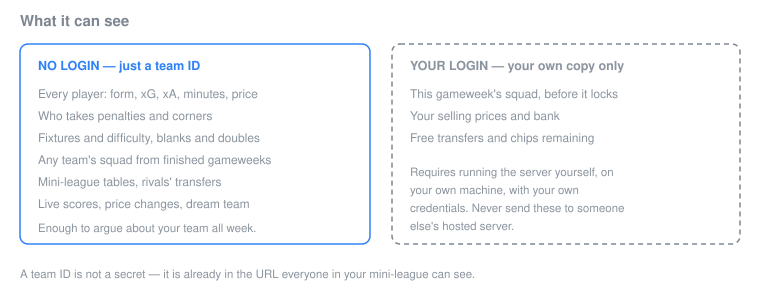
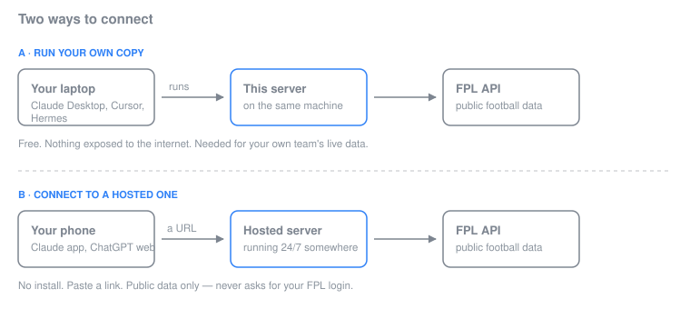

# Fantasy Premier League for your AI

Your AI assistant knows a lot about football and nothing about *this* gameweek. Ask it whether to captain Haaland and it will guess — confidently, from data that stopped being true months ago.

This connects it to the live Fantasy Premier League API. Every player's real form, expected goals, price, ownership and fixture run. Your squad, your mini-league, your rivals' transfers. Then you can actually argue with it about your team.

> **No login required.** Public FPL data needs nothing but a team ID — and a team ID isn't a secret. Connecting your actual FPL account is optional, and covered separately below.

[](https://opensource.org/licenses/MIT)
[](https://www.python.org/)

---

## What you can ask it

- *"Is Mbeumo's form real, or has he just had easy fixtures?"*
- *"Find me a midfielder under £7.0m with better underlying numbers than the one I own."*
- *"Who in my mini-league is closest to me, and what do they own that I don't?"*
- *"I have a wildcard and two free transfers. Talk me through the next four gameweeks."*
- *"Which defenders take set pieces and have three good fixtures coming?"*

The point isn't that it answers. It's that it answers *with the numbers*, inside your own assistant, which remembers what you told it last week.

[](https://youtu.be/QfOOOQ_jeMA)

---

## What it can see



---

## How to connect



Pick the row that matches you.

### A · I just want to ask questions (2 minutes, no install)

Best for phones, and for anyone who doesn't want to install anything. You'll need the URL of a running server — either one someone shared with you, or your own from section B.

**Claude** — works on the free plan.

1. Open [claude.ai](https://claude.ai) in a browser on a computer
2. **Settings → Connectors → Add custom connector**
3. Paste the server URL, click **Add**
4. Open Claude on your phone — it's there too

**ChatGPT** — needs a paid plan, and **does not work in the ChatGPT mobile app**. On desktop web: Settings → enable Developer Mode → add a connector pointing at the same URL.

### B · I want to run it myself

Needed for your own live squad data, and for anyone hosting a server for others.

**Requirements:** Python 3.10+.

```bash
pip install "git+https://github.com/aayush-lunawat/fantasy-pl-mcp-by-rishi.git@feat/public-data-without-auth"
```

> **Install from this branch, not from PyPI.** The published `fpl-mcp` package on PyPI is the upstream release, which predates three things this fork adds: public FPL data working without a login, HTTP transport for hosting, and `--allowed-host`. `pip install fpl-mcp` gets you a server that can't be hosted and still demands credentials to look up a team. These changes have been offered upstream; once merged, PyPI will be the right source again and this note goes away.

On recent Ubuntu or Debian, `pip` may be missing or refuse to install into the system Python ("externally-managed-environment"). Use [uv](https://docs.astral.sh/uv/) instead — often already present:

```bash
uv tool install --from "git+https://github.com/aayush-lunawat/fantasy-pl-mcp-by-rishi.git@feat/public-data-without-auth" fpl-mcp
```

One difference worth knowing: `uv tool install` puts the package in an isolated environment, so `python -m fpl_mcp` won't work afterwards. Use the `fpl-mcp` command, and the absolute path to it in any client configuration.

**For a desktop assistant** (Claude Desktop, Cursor, Hermes) — it runs on demand, with no server to keep alive. Add this to your client's MCP configuration:

```json
{
  "mcpServers": {
    "fantasy-pl": {
      "command": "python",
      "args": ["-m", "fpl_mcp"]
    }
  }
}
```

Where that configuration lives, and what the key is called:

| Client | File | Key |
|---|---|---|
| Claude Desktop (macOS) | `~/Library/Application Support/Claude/claude_desktop_config.json` | `mcpServers` |
| Claude Desktop (Windows) | `%APPDATA%\Claude\claude_desktop_config.json` | `mcpServers` |
| Claude Code | `~/.claude.json`, or `claude mcp add` | `mcpServers` |
| Cursor | `~/.cursor/mcp.json` | `mcpServers` |
| Hermes | `~/.hermes/config.yaml` | `mcp_servers` |

Hermes is the odd one out — YAML rather than JSON, and a snake_case key. Check its own MCP documentation for the entry shape rather than pasting the JSON above.

Restart the client afterwards. If it can't start the server, see Troubleshooting — it's almost always PATH.

**To host it over HTTP** so phones and ChatGPT can reach it:

```bash
fpl-mcp --transport streamable-http --port 8000 --allowed-host fpl.example.com
```

That listens on `127.0.0.1:8000/mcp` — local only, deliberately. To let the outside world in, put a reverse proxy with HTTPS in front. Both Claude and ChatGPT require HTTPS and will not connect to a plain `http://` address.

**`--allowed-host` is not optional when hosting.** The MCP protocol library checks the `Host` header on every request as protection against DNS-rebinding attacks, and out of the box it trusts only localhost. Behind a domain name, every request arrives with your public hostname, and without this flag they're all rejected with `Invalid Host header` (HTTP 421). Pass your real hostname; repeat the flag for more than one.

| Flag | Default | What it does |
|---|---|---|
| `--transport` | `stdio` | `stdio` for desktop clients, `streamable-http` for hosting, `sse` for older clients |
| `--host` | `127.0.0.1` | Bind address. Change only if nothing is proxying in front |
| `--port` | `8000` | Port for HTTP transports |
| `--path` | `/mcp` | URL path the endpoint is served on |
| `--allowed-host` | localhost only | Public hostname clients reach you at. Required behind a proxy or domain |

Environment equivalents: `FPL_MCP_TRANSPORT`, `FPL_MCP_HOST`, `FPL_MCP_PORT`, `FPL_MCP_PATH`, `FPL_MCP_ALLOWED_HOSTS` (comma-separated).

A minimal [Caddy](https://caddyserver.com) config, which handles HTTPS certificates by itself:

```
fpl.example.com {
    reverse_proxy 127.0.0.1:8000
}
```

> **Setting this up with an AI agent instead of by hand?** Point it at [AGENTS.md](AGENTS.md), written for exactly that.

---

## Your first conversation

The first time you ask about *your* team, it will ask which team that is. Nothing is stored about you, so it has no way to know — that's the tradeoff for not needing a login.

Paste your team ID and it carries on. Two ways to avoid being asked again:

**Set it once as a connector header (recommended for a shared/hosted server).** Claude's custom connectors let you set up to four request headers when you add one. Add:

| Header | Value |
|---|---|
| `X-FPL-Team-ID` | your team ID, e.g. `1234567` |

and every request you send carries it automatically — no memory feature needed, works the same on a phone, and each person connecting to the same shared server gets *their own* answer with nothing stored server-side. If you self-host with `--transport stdio`, this header does nothing (there's no HTTP request to carry it on); use `FPL_TEAM_ID` below instead.

**Or put it in your assistant's own memory:** in Claude, **Settings → Profile** (personal preferences), add a line like:

> My FPL team ID is 1234567 — use it when I ask about my team.

Every future conversation then starts knowing it, on any device.

## Finding your team ID

**It is not in the Premier League mobile app** — no screen shows it. Use a browser:

1. Sign in at [fantasy.premierleague.com](https://fantasy.premierleague.com)
2. Click **Points**
3. Read the address bar:

```
fantasy.premierleague.com/entry/1234567/event/3
                                ^^^^^^^
                                your team ID
```

Works the same in a phone browser — tap the address bar to see the full URL, and make sure it's a real browser rather than one embedded in another app, which often hides the address.

**Is it safe to share?** Yes. Your team ID already appears in the URL whenever anyone in your mini-league clicks your name. With it, someone can see your points, rank, past squads, transfer history and leagues. They cannot log in, make transfers, or change anything.

One thing worth knowing: your registered first and last name are public alongside it. That's how FPL works generally, not something this adds.

---

## Connecting your own FPL account (optional)

Only needed for your *current* gameweek squad before the deadline, your selling prices, your bank, or your remaining chips. Everything else — including looking up your own team's public data — works without it; see the lighter-weight option at the end of this section if that's all you want.

**Only ever do this on a server you run yourself.** Never give your FPL credentials to someone else's hosted endpoint — including one a friend sent you.

**Step 1 — get your refresh token.** FPL logs in via PingOne (OIDC), so the credential you need is a refresh token, not your password.

1. Log in at [fantasy.premierleague.com](https://fantasy.premierleague.com) in your browser.
2. Open DevTools (F12) → **Console**, and run:
   ```js
   copy(JSON.parse(localStorage.getItem(Object.keys(localStorage).find(k=>k.startsWith('oidc.user:')))).refresh_token)
   ```
   (If Chrome refuses to let you paste, type `allow pasting` into the console first, press Enter, then run the command above.) Your refresh token is now on the clipboard.
3. Prefer clicking over the console? DevTools → **Application** → **Local storage** → `https://fantasy.premierleague.com` → copy the whole value of the key starting with `oidc.user:` — the setup step below extracts the token from either the bare value or that full JSON blob.

**Step 2 — run setup:**

```bash
fpl-mcp-config setup
```

Paste what you copied when asked, then your [team ID](#finding-your-team-id). Credentials are encrypted at rest in `~/.fpl-mcp/credentials.enc`, tied to your machine.

**Step 3 — validate it worked:**

```bash
fpl-mcp-config test
```

Two things to expect: authenticating retires the token your browser holds, so you'll be signed out of FPL on the web once. And tokens expire periodically — if a working setup stops authenticating later, that's normal; re-run `fpl-mcp-config setup` with a fresh token from Step 1.

**Just want your own public team data, no login at all?** Set the `FPL_TEAM_ID` environment variable to your team ID and skip all of the above — this server treats a self-hosted instance's own team ID as its default for any tool that would otherwise ask "which team is yours", the same public data everyone else gets by pasting a team ID, just without having to repeat it.

---

## Tools

23 tools. Those marked 🔒 need your own credentials; everything else works with just a team ID.

**Players** — `analyze_players`, `compare_players`, `get_player_information`, `search_fpl_players`, `get_price_changes`

**Fixtures and gameweeks** — `analyze_fixtures`, `analyze_player_fixtures`, `get_gameweek_status`, `get_blank_gameweeks`, `get_double_gameweeks`

**Live** — `get_gameweek_live_scores`, `get_dream_team`

**Teams and leagues** — `get_team`, `get_manager`, `get_manager_info`, `get_manager_transfer_history`, `get_league_standings`, `get_league_analytics`

**Your account** — 🔒 `get_my_team`, 🔒 `get_my_current_team`, 🔒 `suggest_captain`, 🔒 `check_fpl_authentication`, 🔒 `update_fpl_credentials`

Plus 5 prompts (transfer advice, player analysis, team rating, differentials, chip strategy) and resources at `fpl://static/players`, `fpl://static/players/{name}`, `fpl://static/teams`, `fpl://static/teams/{name}`, `fpl://gameweeks/current` and `fpl://gameweeks/all`.

---

## Troubleshooting

**Client can't find `fpl-mcp` / `spawn fpl-mcp ENOENT`** — the install directory isn't on the PATH your client sees, because desktop clients launch the server without loading your shell profile. Run `which fpl-mcp` (`where` on Windows) and use that full path in the config, or use the `python -m fpl_mcp` form above. This is the most common setup failure by a distance.

**"No team ID specified"** — pass your team ID explicitly. See above for finding it.

**`Invalid Host header` / HTTP 421 from a hosted server** — you didn't pass `--allowed-host`. The server trusts only localhost by default and rejects requests carrying your public hostname. Restart it with `--allowed-host your.domain`.

**Claude or ChatGPT won't connect to a hosted URL** — it must be HTTPS and reachable from the public internet. Neither connects to `http://`, to `localhost`, or to anything behind a VPN.

**Authentication errors on tools that shouldn't need them, or `--transport` / `--allowed-host` not recognised** — you installed the PyPI release instead of this branch. Reinstall using the command in section B. This is the most common cause of "it doesn't have the features the README describes".

---

## Development

```bash
git clone https://github.com/rishijatia/fantasy-pl-mcp.git
cd fantasy-pl-mcp
pip install -e ".[dev]"
pytest
```

Inspect the server interactively with `mcp dev -m fpl_mcp`, or `npx @modelcontextprotocol/inspector python -m fpl_mcp`.

---

## Credits and licence

Built on [rishijatia/fantasy-pl-mcp](https://github.com/rishijatia/fantasy-pl-mcp) by **Rishi Jatia**. The server, its tools and the FPL authentication flow are his work. MIT licensed — © 2025 Fantasy PL MCP Contributors.

This fork adds HTTP transport for hosting, and removes the credential requirement from FPL endpoints that were always public.

Not affiliated with the Premier League or Fantasy Premier League. It reads the same public API your browser does.
